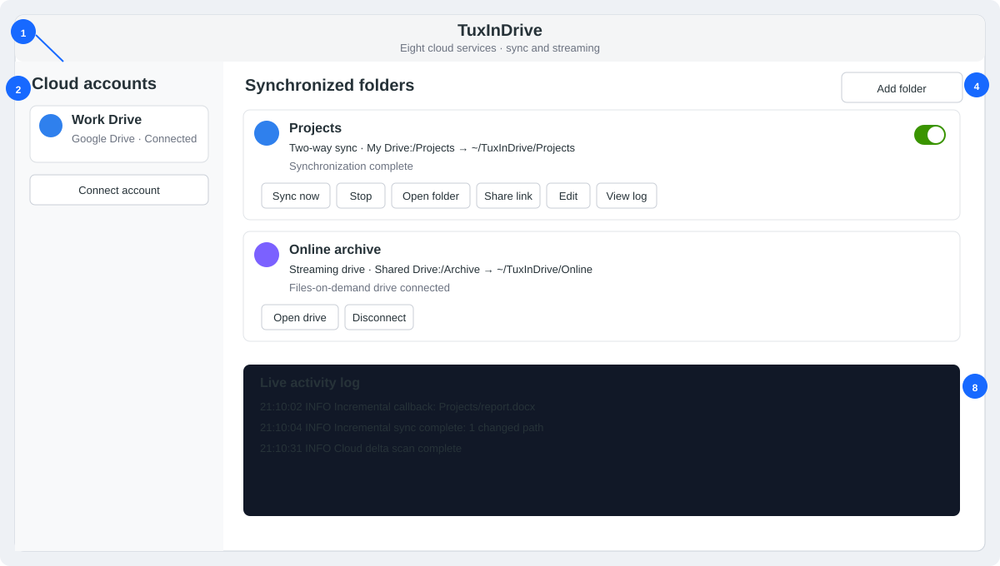
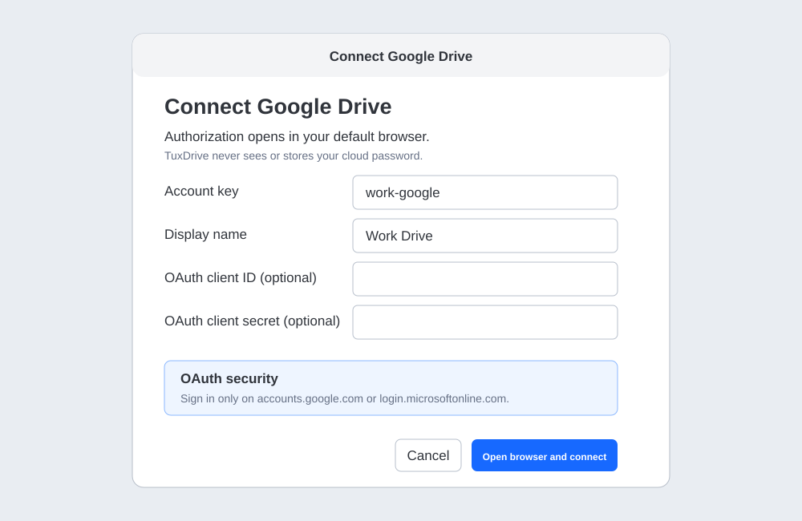
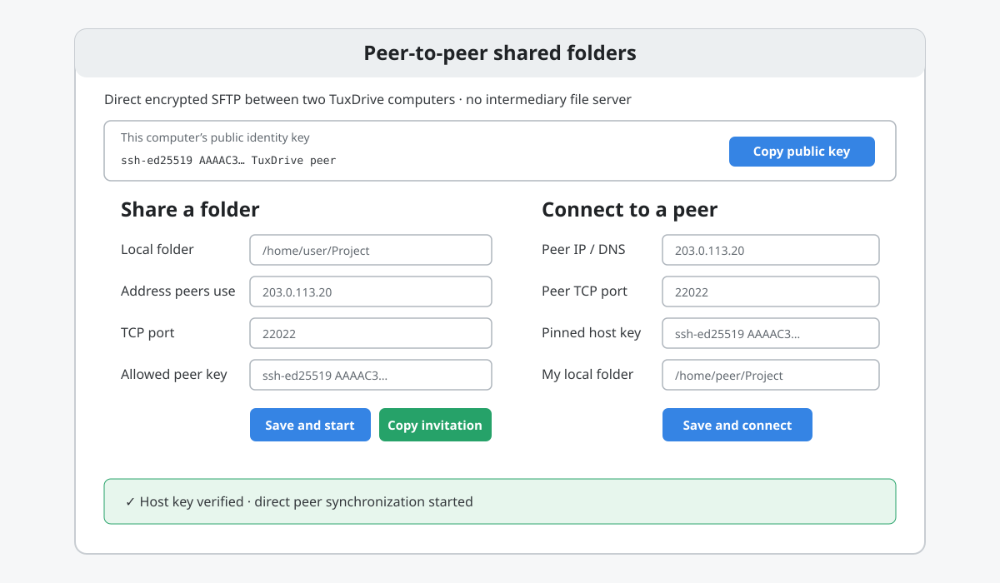
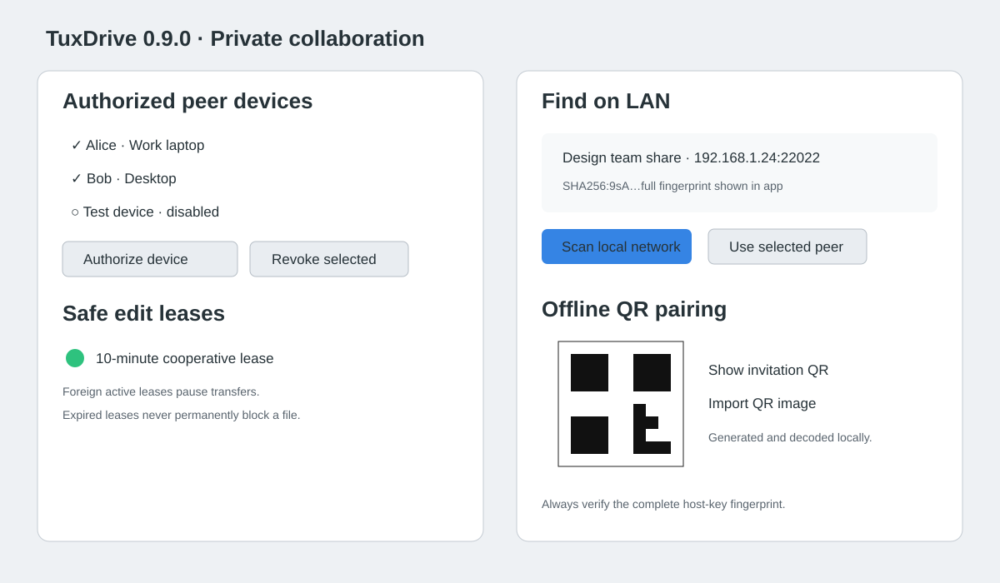
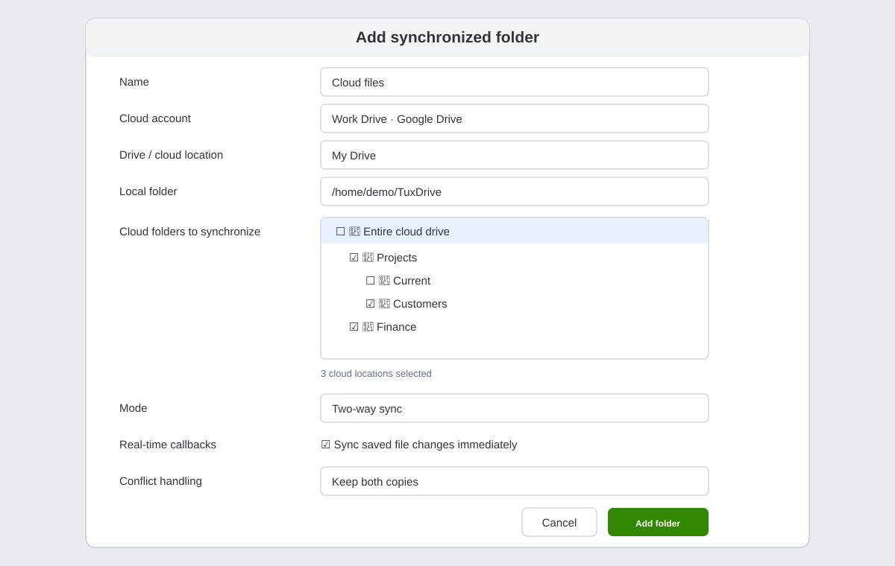
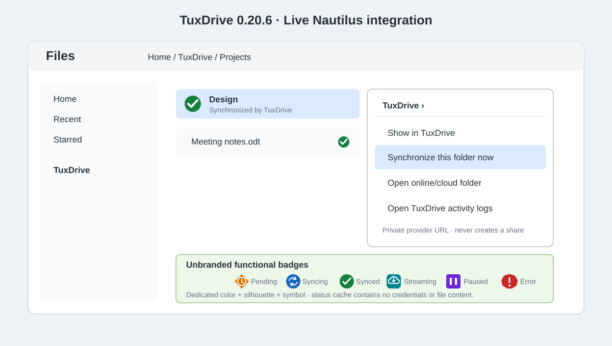
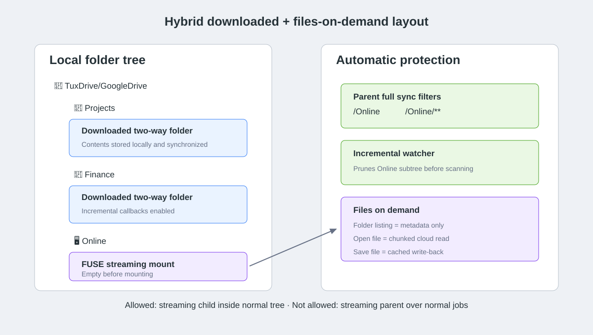
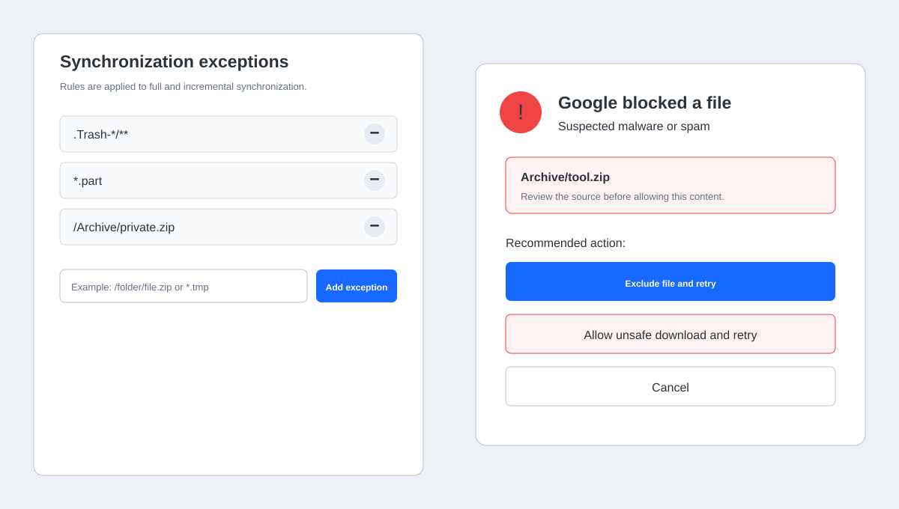
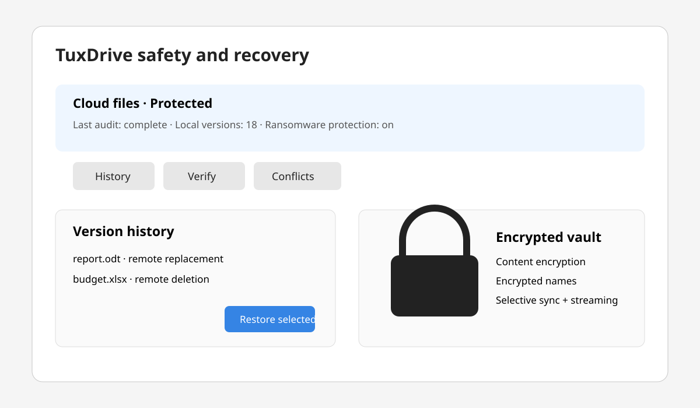
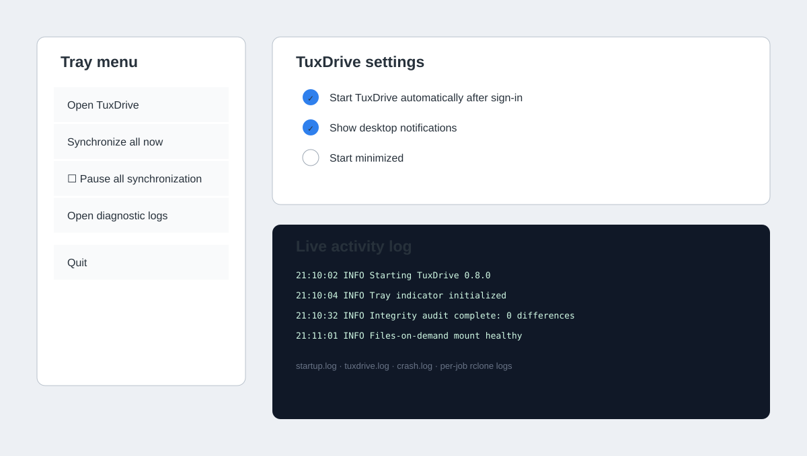

# TuxDrive User Guide

<p align="center"></p>

This guide covers TuxDrive 0.13.1 on Ubuntu 26.04: installation, adaptive cloud-provider controls, Nautilus integration, role-based multi-peer sharing, one-time encrypted drops, the audit and health dashboard, selective synchronization, streaming, recovery, integrity repair, encrypted vaults, updates, and diagnostics.

> The screenshots use sample names and paths. They do not contain real account information.

## 1. Install and start

Download the current Debian package and install it with one command:

```bash
sudo apt install ./tuxdrive_0.13.1_all.deb
```

Launch **TuxDrive** from Ubuntu's application menu. TuxDrive remains active in the system tray when its window is closed. On first start it verifies or installs its private cloud transfer engine.



The main window contains:

1. **Add account** (`+`) — connect Google Drive or Microsoft OneDrive.
2. **Cloud accounts** — connection and aggregate activity state.
3. **Account menu** — open online, reconnect OAuth, or remove an unused account.
4. **Add folder** — create a synchronized or streaming job.
5. **Provider icon and status** — each account/job keeps its Google Drive, OneDrive, Dropbox, Box, pCloud, MEGA, Proton Drive, Nextcloud, peer, or vault icon; the adjacent text and Nautilus emblem communicate synchronization state.
6. **Job controls** — sync/mount, stop, open, share, edit, log, and remove.
7. **Compact enable switch** — pause or resume an individual job without enlarging the row under high-DPI GTK themes.
8. **Live activity log** — current application and transfer activity.
9. **Settings** — startup, notification, and minimized-start preferences.

The black-and-white penguin identifies TuxDrive itself. Each cloud service uses its provider icon while connected and in the account chooser; blue sync and red error badges show changing activity.

### Update TuxDrive

Open **Settings** and select **Check for updates**. A progress window shows repository checking, the available-version result, download percentage, package verification, system installation, and the final success or failure. If a newer version is available, choose **Download and install**. TuxDrive verifies the package checksum before Ubuntu displays its system authorization prompt. When installation completes, restart TuxDrive. If any stage fails, the existing installation remains unchanged and the result stays visible until you close it.

### Rename an item in TuxDrive

Select **Rename** on a synchronized or streaming job and enter the preferred display title. This changes only the label shown inside TuxDrive; it does not rename or move the local folder or its cloud folder.

## 2. Connect a cloud account

Select `+` or **Connect account**, then choose Google Drive, Microsoft OneDrive, Dropbox, Box, pCloud, MEGA, Proton Drive, or Nextcloud.



- **Account key** is TuxDrive's local identifier. Use letters, numbers, dot, dash, or underscore.
- **Display name** is the friendly name shown in the sidebar.
- **OAuth client ID/secret** are optional for personal testing. A dedicated provider application is recommended for regular or organizational use.
- Google Drive, OneDrive, Dropbox, Box, and pCloud normally open browser OAuth. Sign in on the provider's page and approve access; TuxDrive does not receive the cloud password.
- MEGA and Proton Drive use explicit provider credential fields. Nextcloud asks for the server URL, username, and preferably an app password. Secret values are protected before rclone stores them in its private configuration; they are never stored in TuxDrive's account JSON.
- Every provider exposes the same lazy-loading folder tree, multi-folder selection, two-way/one-way modes, and streaming-drive option after connection.
- Proton Drive support follows rclone's beta backend. TuxDrive disables that backend's metadata cache so changes made by another client can be discovered, but provider protocol changes may still require a future TuxDrive/rclone update.
- If the browser callback port is busy, cancel the old authorization window and retry. TuxDrive stops stale OAuth callback processes before opening a new session.

### Proton Drive authentication

Enter the Proton account email and password. If Proton reports that two-factor authentication is required, TuxDrive opens a separate dialog for the current code and retries verification. You may instead provide the account's OTP secret key during setup when recurring automatic authentication is appropriate. Enter a mailbox password only for older Proton accounts configured in two-password mode. TuxDrive tests a root-folder listing before it accepts the account, so an incomplete remote is no longer displayed as **Connected**.

If Proton Drive was added with TuxDrive 0.6.0 or 0.6.1 and folder browsing says that a username and password are required, open the account's menu and choose **Reconnect / refresh credentials**. Fill in the Proton fields; synchronized-job definitions do not need to be recreated.

Proton Drive support uses rclone's beta backend. Proton protocol changes may require an updated TuxDrive transfer engine, and Proton may apply additional authentication checks to some accounts.

The account menu provides:

- **Open online** — opens the provider website.
- **Reconnect OAuth** — refreshes authorization without deleting jobs.
- **Remove account** — available after all jobs using that account are removed.

### Google cloud locations

TuxDrive lists these separately:

- **My Drive**
- **Shared with me**
- every available **Shared Drive**

Changing the cloud location refreshes the visual folder tree. This prevents a remote preconfigured for one Shared Drive from hiding My Drive or other shared locations.

## 3. Direct encrypted multi-peer sharing

Select the network icon or open **Settings → Peer-to-peer sharing**. One sharing computer runs an authenticated SFTP endpoint backed by its selected folder. Any number of explicitly authorized TuxDrive devices can connect with their individual keys. File data travels directly between endpoints and is not stored by TuxDrive, GitHub, a discovery directory, or a cloud provider.





### Authorize multiple devices

Each installation creates a private Ed25519 identity. On every connecting computer select **This computer's public identity key → Copy public key** and exchange only the public line through a trusted channel. On the host enter a readable device name, paste the key, and select **Authorize device**. Repeat for every collaborator. A device can be disabled temporarily or revoked by selecting it, choosing **Revoke selected**, then **Save and start**.

### On the computer sharing the folder

1. Open **Share a folder** and select the local folder.
2. Enter the current LAN/public IP address or DNS name that the other computer will use.
3. Choose an unprivileged TCP port, such as `22022`.
4. Add one or more named peer public keys under **Authorized peer devices**.
5. Choose whether the share is advertised on the LAN and set the edit-lease duration.
6. Select **Save and start**, then **Copy invitation** or **Show invitation QR**.
7. Send the invitation to authorized users through a trusted channel.

The IP/DNS address, port, folder, authorized devices, discovery state, lease duration, NAT behavior and optional relay remain editable. Saving restarts the endpoint with the new settings. Stopping or deleting a share never deletes files.

### NAT traversal and optional no-storage relay

**Automatically request UPnP/NAT-PMP port mapping** is enabled for new shares. TuxDrive first asks the router to expose the selected peer port using UPnP, then tries NAT-PMP when available. This is best-effort: router policy, carrier-grade NAT and firewalls can still prevent direct access.

For those cases, enter an SSH relay hostname, SSH user, SSH port and unused public forwarding port. TuxDrive creates a reverse SSH tunnel from the sharing computer. A connecting peer still uses TuxDrive's pinned, encrypted SFTP session inside that tunnel; the relay forwards ciphertext, receives no TuxDrive private key and stores no file body. The relay operator must enable remote TCP forwarding/GatewayPorts for the selected account. Leaving relay fields blank preserves direct-only operation.

### Block-level peer delta transfer

**Use block-level delta transfer** is enabled by default on new jobs. For direct peer callback updates, TuxDrive divides a file into 4 MiB content-addressed blocks and compares the new BLAKE2 manifest with the last successfully transferred version. Only changed blocks plus a small instruction are uploaded through the authenticated, host-key-pinned transport into the peer transaction queue. The receiving TuxDrive verifies every block, reconstructs a temporary file, validates its complete SHA-256 and atomically replaces the destination. A first transfer or missing manifest sends every block. Cloud backends continue using their provider/rclone native transfer behavior.

### LAN discovery and QR pairing

If **Advertise this share on the local network** is enabled, open **Find on LAN → Scan local network** on another computer. Discovery uses local-scope UDP multicast and advertises only the share name, address, port, public host key, share ID, and lease duration. It does not authenticate a person and does not normally cross routers.

Select a result and compare its complete `SHA256:` host-key fingerprint with the host through a second trusted channel. Only then choose **Use selected peer**. Alternatively, show the invitation QR on the host and choose **Import QR image** on the client. QR encoding and decoding occur locally using tools installed by the Debian package; no online QR service sees the invitation.

### On the computer connecting to the folder

1. Open **Connect to a peer**, paste the invitation, and select **Load invitation**.
2. Review the displayed IP/DNS address, port, and host public key with the sharing user.
3. Select a local folder and choose **Save and connect**.
4. TuxDrive first creates a temporary connection, pins and verifies the host key, and lists the peer folder. Only after that succeeds does it save the connection and start two-way synchronization.

The saved peer entry lets you continuously edit a changing IP/DNS address or port. Changes are verified before replacing the working endpoint. The same move, deletion, conflict, callback, exception, and logging rules used by cloud two-way synchronization apply.

### Safe edit leases

Peer jobs enable cooperative edit leases by default. Before an incremental local upload or deletion, TuxDrive writes a short lease record into the hidden `.tuxdrive-leases` area and confirms ownership. It releases the record after transfer. A complete reconciliation pauses while a foreign, unexpired lease exists. Lease metadata is excluded from ordinary synchronization.

Leases reduce accidental simultaneous overwrites between TuxDrive peers, but they are advisory application locks: they do not prevent another program, a non-TuxDrive SFTP client, or a malicious authorized device from writing. A crash may leave a record until expiry; the timeout prevents permanent lockout. Use an application-specific collaboration system for databases or real-time coauthoring.

### Directional peer roles

Each named authorized device can be assigned one role before its invitation is copied:

| Role | Paired TuxDrive behavior |
|---|---|
| **Read and write** | Two-way synchronization with the normal conflict, lease and deletion protections. |
| **Read-only** | Copies new/changed host content locally without deleting local extras or uploading changes. |
| **Send-only** | Uploads the device's selected local folder; it does not download host changes. |
| **Receive-only** | Mirrors host content locally, including allowed deletions; it never uploads local changes. |

Select the device row before choosing **Copy invitation** or **Show invitation QR**. Protocol-v4 invitations carry the selected role, and the receiving job locks its direction accordingly. If every enabled device on an endpoint is read-only/receive-only, the SFTP server is also launched in read-only mode. With mixed roles, direction is enforced by paired TuxDrive clients; because the underlying interoperable SFTP service cannot assign a different filesystem policy to every key on one port, do not give a role-limited key to a generic SFTP client. Use separate shares/ports where hostile-client enforcement is required.

### One-time encrypted file drop

Select a saved/running share, enter the sender's device name and public identity key, choose an expiry from 1–168 hours, then select **Create one-time file drop**. TuxDrive creates a random hidden inbox, restarts authorization, and copies an upload-only invitation. The sender loads the invitation, chooses a local folder, and sends it over the same encrypted, host-key-pinned SFTP transport.

The invitation exposes only its inbox path, expires at the encoded UTC time, and is retired locally after a successful send. The host detects the first received file and permanently records a consumed marker so the temporary key is omitted after restart. Ordinary synchronization excludes `.tuxdrive-drops`, preventing inbox data from appearing in other peer jobs. A connection already authenticated when the first file arrives may finish its current transfer; one-time means one upload session, not a one-packet limit.

### Peer and synchronization audit timeline

The chart button in the title bar opens **Sync health and audit**. Its audit page records job starts, completions, failures, policy deferrals, verified peer connections, block-delta application, and one-time-drop creation/consumption. Records are stored locally in `~/.local/share/tuxdrive/audit.jsonl` with user-only permissions, capped by automatic compaction, and never contain credentials or private keys. Paths and peer display names are operational metadata; protect the local user account if those names are sensitive.

### Network and security limitations

- The sharing computer must remain running and TuxDrive must remain active.
- For internet access, TuxDrive first attempts UPnP/NAT-PMP. If automatic mapping is unavailable, configure a manual port forward, use a peer-reachable VPN, or enable the optional no-storage SSH relay. Carrier-grade NAT commonly requires the VPN or relay option.
- Permit only the selected port in the host firewall. Restrict it to the other peer's source IP where practical.
- The connecting public key authenticates the guest; the invitation's pinned host public key authenticates the server. If either key changes unexpectedly, stop and verify with the other user instead of bypassing validation.
- LAN discovery is convenience, not trust. Always compare the complete fingerprint.
- Revocation prevents future authentication after the share restarts; it cannot retract copies already downloaded by that device.
- Every authorized device has the same folder-level access in 0.9.0. Per-device roles remain roadmap work.
- This is direct encrypted transport, not anonymous communication. Endpoint IP addresses are visible to each peer and to intervening network operators.
- Keep backups of important collaborative data: two-way synchronization intentionally propagates allowed changes and deletions.

## 4. Add synchronized folders

Select **Add folder**. Choose the account, drive/location, and one or more cloud folders in the tree.

The **Provider capabilities** row updates when the account changes. It explains whether the backend supports streaming, change polling, hashes and safe share links. Unsupported modes are omitted and unsafe actions such as share-link creation are disabled. Capabilities are conservative TuxDrive defaults; Nextcloud and organizational provider configurations can vary, so live validation and the scheduled reconciliation safety net remain important.



### Folder tree

- Expand arrows to load child folders on demand.
- Select **Entire cloud drive** for the full selected location.
- Select multiple folders to create one job and local folder per selection.
- The local folder chooser determines where downloaded data is stored.

### Synchronization modes

| Mode | Behaviour |
|---|---|
| **Two-way sync** | Changes, moves, and allowed deletions propagate in both directions. |
| **Download mirror** | Cloud is authoritative; local content mirrors it. |
| **Upload mirror** | Local content is authoritative; cloud content mirrors it. |
| **Streaming drive (files on demand)** | The cloud tree is mounted through FUSE; contents download only when opened. |

### Job options

- **Sync interval** — periodic complete reconciliation. It remains active as a safety net.
- **Real-time callbacks** — watches local saves (about two seconds) and polls cloud changes (about 30 seconds), transferring only changed paths.
- **Conflict handling** — keep both, newer wins, local wins, or cloud wins.
- **Maximum deletions** — safety ceiling for one synchronization run.
- **Local version history** — retains replaced/deleted content for recovery; enabled by default.
- **Version retention** — number of days local recovery entries are retained.
- **Ransomware protection** — previews established jobs and pauses suspicious change bursts.
- **Mass-change path/percentage limits** — job-specific thresholds that trigger the safety pause.
- **Bandwidth limit** — rclone notation such as `10M`.
- **Google security warning** — unsafe opt-in for files Google marks as malware/spam. Leave disabled unless the file is trusted.
- **Synchronization exceptions** — clickable rules; add a pattern or remove it with the minus button.

## 5. Operate a synchronization job

Each job offers:

- **Sync now** — start a complete reconciliation immediately.
- **Stop** — cancel the active transfer.
- **Open folder** — open the local folder in Files.
- **Share link** — create a provider link and copy it to the clipboard.
- **History** — inspect and restore local versions or recycled files.
- **Verify** — compare both sides and repair reviewed paths from the chosen authority.
- **Conflicts** — open the conflict-focused review center.
- **Edit** — change the mode, paths, selection, interval, conflict handling, and rules.
- **View log** — open the directory containing transfer logs.
- **Trash button** — remove the job configuration without deleting local or cloud files.
- **Switch** — enable or pause automatic operation.

Status icons and labels change for idle/connected, synchronizing, paused, and error states. The account icon summarizes all jobs belonging to that account.

### Sync health dashboard

Select the chart icon in the title bar. **Sync health** shows each job's current running/mounted/error/paused state, mode, peer access role, callback-monitor state, last run, and latest detail. **Audit timeline** shows recent structured operational events. **Provider capabilities** compares all ten TuxDrive backends across streaming, polling, hashes, server moves and share links. Reopen the dashboard to refresh its point-in-time snapshot.

### Nautilus integration

Version 0.10.0 installs a native extension for Ubuntu Files (Nautilus 4). Right-click a configured synchronization folder, a subfolder, a file inside it, or the empty background of that folder and open the **TuxDrive** submenu:

- **Show in TuxDrive** opens the application and displays the containing job's current status.
- **Synchronize this TuxDrive folder now** starts the containing normal synchronization job using the same conflict, deletion, ransomware, exception, and lease protections as the main window. Multiple selected files must belong to the same job.
- **Open TuxDrive activity logs** opens the diagnostic log directory.
- **Open online/cloud folder** opens the matching private provider page where the backend exposes a safe item ID/path. Google Drive, Dropbox, Box, and supported OneDrive configurations can open exact items; other providers open their account root when available. This action never creates a public sharing link.

Configured paths expose TuxDrive status metadata and a synchronized/error emblem to Nautilus. Files-on-demand drives show their streaming status; their content is still fetched by opening the file, so the explicit synchronization action is intentionally omitted.
TuxDrive 0.10.2 includes its own green synchronized, blue streaming, and red error emblems and completes Nautilus 4 metadata requests explicitly, so badge availability no longer depends on the desktop icon theme.

TuxDrive 0.10.3 supports the Nautilus 4.0 and 4.1 GI namespaces used across supported Ubuntu installations. It intentionally does not request an exact minor namespace because Nautilus loads its own version before importing extensions.

Version 0.12.0 publishes job state through a private atomic cache file watched by the extension. Badges refresh among pending, synchronizing, synchronized, streaming, paused, and error states when application state changes. The cache contains job identifiers and display status only—never OAuth tokens, passwords, private keys, or file content.

Nautilus integration is enabled by default. Disable **Settings → Enable Nautilus integration** to hide all TuxDrive menus, metadata and emblems; restart Files with `nautilus -q` after changing the flag. Synchronization and streaming continue without the extension.

The extension sends requests to TuxDrive's single application instance. If TuxDrive is closed, it starts in the background and waits for the verified transfer runtime before starting a requested job. It never runs a second independent transfer engine inside Nautilus.

After first installation or upgrade, close and reopen Files. If the submenu does not appear, run `nautilus -q` once and reopen Files. Non-local URIs, unconfigured folders, and disabled jobs do not receive synchronization actions.



## 6. Incremental synchronization

When **Sync saved file changes immediately** is enabled:

1. TuxDrive debounces editor save sequences.
2. It compares local and cloud snapshots.
3. Only created, changed, moved, or deleted paths are transferred.
4. Echo events created by TuxDrive's own transfer are absorbed to avoid loops.
5. If the same path changed on both sides, TuxDrive runs the normal reconciliation path.

LibreOffice/Microsoft Office lock files, editor swap files, browser partial downloads, and `.part` files are ignored automatically. A temporary file that disappears during transfer is treated as a harmless skipped event.

## 7. Streaming files on demand

A streaming drive exposes real file names, folders, sizes, and modification times without downloading file bodies. Opening a file reads it in chunks and places accessed content in a bounded cache (10 GB by default). Writes are uploaded after the write-back delay.

### Per-file offline availability

Right-click a file or folder inside a streaming drive and choose **TuxDrive → Always keep available offline**. TuxDrive reads the complete selection into its private VFS cache, stores the persistent pin rule in the job and disables normal age expiry while pins exist. Test availability before disconnecting the network, especially for very large trees.

Choose **Free local space (online only)** to remove that rule and matching cached content. Choosing it on the streaming root clears all pin rules and the job's streaming cache. Unsynchronized local write-back content is never intentionally discarded; disconnect the drive cleanly and confirm uploads before freeing space.



### Standalone streaming drive

Choose an empty mount folder such as:

```text
~/TuxDriveStreaming/GoogleDrive
```

Select **Start streaming**. TuxDrive reports connected only after Linux confirms the FUSE mount. **Open drive** opens the mounted tree; **Disconnect** unmounts it.

### Hybrid downloaded + streamed layout

A streaming folder may be an empty child of a normal synchronized tree:

```text
~/Tuxdrive/GoogleDrive/
├── Finance/       downloaded/two-way
├── Projects/      downloaded/two-way
└── Online/        streaming/files on demand
```

TuxDrive automatically excludes `/Online` and `/Online/**` from the parent job's complete sync and incremental watcher. This prevents recursive transfer of mounted cloud files.

Safety rules:

- the streaming mount folder must be empty before connection;
- a streaming folder may be a **child** of a normal job;
- a streaming folder cannot be the **parent** of another sync job;
- two normal jobs and two streaming jobs cannot overlap.

If the mount exits unexpectedly, TuxDrive updates the status and retries up to three times in five minutes.

## 8. Exceptions and blocked files



Exception rules use rclone filter syntax. Common examples:

| Rule | Result |
|---|---|
| `/Archive/private.zip` | Excludes one exact path. |
| `*.tmp` | Excludes temporary files at any level. |
| `/Cache/**` | Excludes a directory subtree. |
| `*.iso` | Excludes all ISO images. |

When Google blocks a file as suspected malware or spam, TuxDrive shows an interactive decision:

- **Exclude file and retry** — recommended; adds an exact clickable exception rule.
- **Allow unsafe download and retry** — explicitly accepts the provider warning for that job.
- **Cancel** — leaves the job stopped for manual review.

To remove an exception, choose **Edit**, find **Synchronization exceptions**, and click the minus button beside the rule.

## 9. Recovery, protection, verification, and vaults



### Local version history and recycle recovery

Each normal sync job enables **Local version history** by default. Before an incoming cloud/peer replacement or deletion changes an existing local file, TuxDrive copies the current version into its private recovery area. Full bisync runs also direct replaced versions into dated backup directories on both sides. Set **Version retention (days)** in **Edit**; expired local entries are pruned after incoming changes.

Select **History** on a job to see the file, saved time, reason, and size. Select an entry and choose **Restore selected**. If a current file exists, it is archived before restoration, and TuxDrive queues synchronization. Local recovery files live under `~/.local/share/tuxdrive/recovery`. The cloud-side `.tuxdrive-versions` folder is application data and should not be selected as a second sync root.

### Ransomware and mass-change protection

For an initialized job, TuxDrive performs a non-destructive dry run before a scheduled or manual full sync. It pauses instead of propagating changes when the unique changed-path count, changed percentage, deletion burst, or known ransomware-like filename suffix crosses the job's configured threshold. Real-time callback batches pass through the same gate.

When protection pauses a job, the enable switch is turned off and the preview log is retained. Review the activity and job log, disconnect a compromised computer if necessary, restore files from **History**, and run **Verify**. Re-enable the job only after the source of the changes is understood. Thresholds are safeguards, not malware detection; they do not replace endpoint security or independent backups.

### Integrity audit and repair

Select **Verify** to compare the local tree with its cloud or peer tree. The audit uses available hashes; encrypted vaults use downloaded content verification because ciphertext hashes cannot be compared directly. It reports content differences, local-only paths, remote-only paths, and verification errors without changing files.

Tick only reviewed findings, then choose **Use local versions** or **Use cloud/peer versions**. TuxDrive asks for confirmation and repairs only those paths. Affected local content is archived where possible. Run **Verify** again after repair; a completed transfer is not itself proof that every byte now matches.

### Conflict review center

Select **Conflicts** to show content mismatches requiring an authoritative side. Choose the reviewed items, then use the local or cloud/peer versions. Keep-both synchronization still creates dated `tuxdrive-conflict` copies when automatic resolution is disabled; inspect those alongside the center before removing either copy.

### Encrypted cloud vaults

Connect the underlying cloud account first. Select **Connect account → Create encrypted vault**, choose that account, and enter a new dedicated folder such as `TuxDriveEncrypted`. Choose filename encryption, enter a strong password twice, and optionally add a filename salt. TuxDrive creates a client-side crypt remote: file bodies, and by default file and directory names, are encrypted before upload. The new vault then works with the same visual folder selection, sync, streaming, history, and audit controls.

Never point a vault at a folder containing ordinary unencrypted files, never edit ciphertext through the underlying account, and do not configure both the vault and its backing folder as sync jobs. TuxDrive cannot recover the vault password or salt. Store both in a password manager and test recovery with non-critical data before relying on the vault.

## 10. Tray and settings



### Network, battery and schedule policies

The default policy is **Maximum usage (no policy limits)**, matching earlier TuxDrive releases. To constrain transfers, select **Apply network, battery and schedule policies** and configure any combination of:

- disallowing NetworkManager connections marked metered;
- a battery percentage below which transfers pause while AC power is disconnected (`0` disables it);
- a daily `HH:MM` start/end window, including an overnight window such as `22:00`–`06:00`.

The gate runs before manual, callback and scheduled jobs. Deferred jobs show the policy reason and are reconsidered by the regular scheduler. Metadata already displayed by a mounted streaming filesystem can remain visible, but opening non-cached content still requires network access.

The tray menu contains:

- **Open TuxDrive**
- **Synchronize all now**
- **Pause all synchronization**
- **Open diagnostic logs**
- **Quit**

Settings control:

- automatic start after sign-in;
- desktop notifications;
- starting minimized.

Closing the main window hides it; synchronization continues in the tray. Use **Quit** to stop the application and unmount streaming drives.

## 11. Logs and diagnostics

| Location | Purpose |
|---|---|
| `~/.local/state/tuxdrive/startup.log` | Launcher and missing-runtime failures. |
| `~/.local/state/tuxdrive/tuxdrive.log` | Application lifecycle and job state. |
| `~/.local/state/tuxdrive/crash.log` | Uncaught Python/thread and native crash details. |
| `~/.cache/tuxdrive/logs/` | Individual synchronization and mount logs. |

Print diagnostic paths with:

```bash
tuxdrive --diagnostics
```

The expandable **Live activity log** shows recent application and transfer messages directly in the UI.

## 12. Troubleshooting

### Streaming folder is empty

1. Confirm the job button says **Open drive**, not **Start streaming**.
2. The mount folder must be empty before connection.
3. If nested, it must be a child—not the parent—of a normal sync job.
4. Open **View log** and look for FUSE, mount, authentication, or unsupported-flag errors.
5. Disconnect and select **Start streaming** again.

Version 0.10.1 writes a streaming preflight block containing the TuxDrive version, remote, mount point, rclone path, `/dev/fuse` availability, and `fusermount3` location. It automatically detaches an orphaned FUSE mount left by a crash or unexpected rclone exit and waits up to 45 seconds for large cloud trees. The Nautilus extension uses lexical path matching, so it does not resolve or stat disconnected streaming endpoints. The app displays the most relevant mount failure directly while the full command activity remains in the job log.

### Proton Drive says username and password are required

The account was created without the Proton backend credentials. Open its menu, choose **Reconnect / refresh credentials**, enter the required Proton email and password (plus 2FA/OTP information when applicable), and wait for **Verifying cloud access** to complete. TuxDrive retains the existing sync jobs and validates the repaired remote before returning it to the connected state.

### Job reports recovery sync required

TuxDrive pauses automatic operation after a critical bisync abort to avoid repeated destructive resyncs. Review the log, resolve the cause, enable the job, and select **Sync now**.

### Google shows only part of the account

Edit/add the job and select the correct location: My Drive, Shared with me, or the intended Shared Drive. Then browse that location's tree.

### Google shared client warning

For continued organizational use, register a Google desktop OAuth client and reconnect the account with its client ID/secret. Do not commit credentials or OAuth tokens.

### Application does not start

Run:

```bash
tuxdrive --diagnostics
cat ~/.local/state/tuxdrive/startup.log
cat ~/.local/state/tuxdrive/crash.log
```

Reinstall the current package with `sudo apt install ./tuxdrive_0.13.1_all.deb`.

## 13. Data safety

- Back up important data before introducing any bidirectional synchronization tool.
- Review conflict and maximum-deletion settings before the first run.
- Keep unsafe Google flagged-file access disabled unless the content is trusted.
- Do not point multiple normal jobs at overlapping local folders.
- Removing a TuxDrive job does not delete its local or cloud files.
